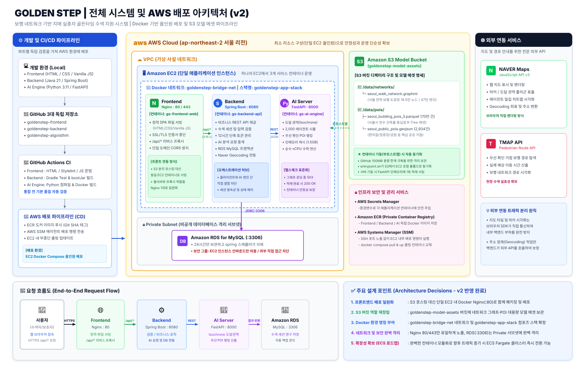

# 🧭 GoldenStep AI 코어 엔진 기술 명세서 및 종합 README (GoldenStep Algorithm Engine)

> **보행 네트워크 토폴로지 및 다중 에이전트 공간 확률 통계 기반 초기 실종자 수색 의사결정 지원 마이크로서비스**

---

## 1. 프로젝트 개요 (Project Overview)

### 1.1 프로젝트 정의 및 개발 배경

* **프로젝트명**: 골든스텝 (GoldenStep)
* **핵심 주제**: 보행 네트워크 및 공간 통계 기반 초기 실종자 탐색 의사결정 지원 플랫폼
* **추진 배경 및 미션**:
  * 실종 및 연락 두절 초기 골든타임 내에 전문 수색 인력이 투입되기 전까지 보호자가 겪는 무작위 수색과 시간 낭비를 방지하기 위한 의사결정 보조 도구입니다.
  * 지도의 단순 직선거리 동심원 반경의 한계를 극복합니다.(하천, 고속도로, 절벽 등 물리적 단절로 인한 실제 이동 거리의 한계를 극복합니다.)
  * 오픈스트리트맵(OSM)의 실제 보행 도로망(Walk Network) 데이터를 분석하여 경과 시간 내 도보로 도달 가능한 물리적 구역(등시선, Isochrone Polygon)을 도출 합니다.
  * 단순 동심원 반경 대비 수색 면적을 기하학적으로 압축 함과 동시에, 유력한 수색 도로망 및 거점(POI) TOP 3를 실시간으로 도출합니다.
  * 인명 안전과 직결되는 우선 확인 거점 선별 및 확률 전이 로직에서 환각(Hallucination) 위험이 있는 거대언어모델(LLM)을 배제하고 수학적 효용 점수식 및 통계적 무작위 보행(Monte Carlo)만을 적용합니다.

---

## 2. AI 코어 철학 및 모델링 설계 원칙 (Design Principles)

### 2.1 결정론적 알고리즘 원칙 (No-LLM Policy)

* 인공지능 환각(Hallucination) 위험을 원천 배제하기 위해 생성형 LLM을 배제하고 검증된 공간 통계 및 수학적 효용 점수식만을 적용합니다.

### 2.2 딥러닝/신경망 모델을 배제한 이유

* 일반적인 지도학습 머신러닝/신경망 모델을 사용하려면 교차로마다 실종자가 어디를 선택했는지 기록된 수만 개의 초 단위 연속 궤적 GPS 데이터가 필요합니다.
* 그러나 개인정보 및 보안 문제로 연속 궤적 데이터가 존재하지 않으며, 오직 통계적 내용이 담긴 논문만 존재합니다.
* 따라서 본 시스템은 딥러닝 가중치 파일(.pt, .onnx)을 로드하는 방식이 아닌, 의학·수색 통계 규칙을 수학 공식으로 구현한 '다중 에이전트 몬테카를로 시뮬레이션(Multi-Agent Simulation) & 공간 네트워크 알고리즘'으로 동작합니다.

### 2.3 도메인 문헌 기반 결정론적 파라미터 매핑 (Domain-driven Parameter Formulation)

* 본 시스템은 연속 궤적 GPS 데이터 부재로 인한 지도학습 및 머신러닝 최적화(Optuna/Grid Search)의 한계를 인식하고, 국제 공인 수색 교본(Robert J. Koester의 ISRID 통계 및 Tobler 지형 함수)의 실측 통계를 바탕으로 거동 수식을 결정론적으로 정식화하여 고정 적용하였습니다.
* 직접 구축한 과거 실종-발견 벤치마크 데이터셋은 사전에 정의된 물리·통계 규칙으로 도출한 수색 권역이 실제 발견 위치를 블라인드 상태에서 얼마나 포섭하는가 (ARR, Hit-Rate)를 객관적으로 측정하는 단일 검증 잣대로만 활용되었습니다.

---

## 3. 핵심 수학적 모델링 및 행동 역학 수식 (Mathematical Modeling)

### 3.1 모델 파라미터 및 수식 산출 기준

* **물리적 최대 권역 ($A_1$, Kinematic Baseline)**:
  - 프로젝트에서 정한 초기 기준 보행 속도($v_0$)와 경과 시간($t$)의 단순 등속 곱($R_{\max} = v_0 \times t$)을 통해 물리적 한계 반경을 설정합니다.
* **갈림길 의사결정 로직 (다항 로짓 기반 효용 모델)**:
  - **직진 관성 ($S_{ij}$)**: 진입 방향과 후보 도로 간의 코사인 유사도 ($\cos \Delta\theta_{ij} \in [-1.0, 1.0]$)
  - **오르막 저항 ($H_{ij}$)**: 고도차 기반 오르막 경사 페널티 ($\max(0, \frac{\Delta z}{L})$)
  - **도로 위계 ($W_j$)**: 보행 환경에 따른 도로 폭 가중치 (대로변 $1.0$, 이면도로 $0.6$, 골목길 $0.2$)
* **벤치마크 데이터셋의 역할**:
  - 수집한 기사 내용을 바탕으로 위치를 추정(추정 불가 시 행정구역 중심 기준 좌표 보정)하여 직접 생성한 데이터셋은 모델 학습용이 아닙니다.
  - 사전에 정의된 물리 도로망 버퍼 규칙이 실제 사건의 발견 지점을 블라인드 상태에서 얼마나 포함하는지 확인하기 위한 '사후 검증(Evaluation) 용도'로만 사용되었습니다.

### 3.2 단계별 수색 면적 압축 체계 ($A_1 \rightarrow A_2 \rightarrow A_3$)

수색 면적 축소율($ARR$)은 외곽 끝점을 단순 연결한 허위 다각형 면적이 아닌, **실제 보행 도로망 선형 버퍼(Street Buffer)**를 기준으로 3단계 깔때기 구조를 통해 기하학적으로 산출합니다.

* **$A_1$ (Kinematic Baseline, 물리적 최대 도달 원형 영역)**:
  - 초기 기준 보행 속도($v_0$)와 경과 시간($t$)의 단순 등속 곱을 반경으로 하는 절대 한계 영역입니다.
  $$R_{\max} = v_0 \times t, \quad A_1 = \pi \cdot (R_{\max})^2$$
  *(단, $A_1$은 수색 확률 분포가 아닌 물리적으로 이탈할 수 없는 최대 경계선(Boundary)을 의미합니다.)*

* **$A_2$ (Walkable Network Area, 반경 내 전체 보행 가능 도로 면적)**:
  - $A_1$ 원형 영역 내에 포함되는 오픈스트리트맵(OSM) 보행 도로망 전체 선형에 중심선 기준 편측 $5\text{m}$(총 도로 폭 $10\text{m}$) 버퍼를 적용한 뒤 합집합(Unary Union)을 수행한 순수 보행로 면적입니다.
  - **1차 물리적 축소 ($ARR_1$)**: 하천, 철도, 건물 옥상, 고속화도로 등 보행 불능 지형을 지리 공간적으로 배제하여 초기 수색 면적을 1차 소거합니다.
  $$ARR_1 = \left(1.0 - \frac{\text{Area}(A_2)}{A_1}\right) \times 100\%$$

* **$A_3$ (Traversed Network Area, 2,000명 실제 통과 도로망 면적)**:
  - 가상 에이전트 2,000명이 갈림길 효용 모델(직진 관성, 오르막 회피, 도로 폭 선호)을 바탕으로 실제로 통과한 고유 도로(Unique Edges)들에 동일한 폭 $10\text{m}$ 버퍼를 적용한 실질 수색 면적입니다.
  - **2차 행동 모델 압축 ($ARR_2$)**: 전체 보행로($A_2$) 중 유력한 상위 도로망을 선별하여 추가 면적 압축을 합니다.
  $$ARR_{\text{total}} = \left(1.0 - \frac{\text{Area}(A_3)}{A_1}\right) \times 100$$

### 3.3 다항 로짓 기반 갈림길 의사결정 및 보행 시뮬레이션 모델 (Multinomial Logit Model)

* 가상 에이전트 2,000명이 출발점에서 무작위 보행(Monte Carlo Random Walk)을 수행하며 각 교차로(노드 $i$)마다 연결된 도로($j \in \mathcal{N}(i)$)로 전진하거나 이동을 종료하도록 모델링합니다.

* **(1) 갈림길 이동 효용 수식 ($U_{ij}$)**:
  - 에이전트가 이전 노드에서 현재 교차로 $i$에 도달했을 때, 연결된 후보 도로 $j$를 선택할 기하학적 매력도(효용 점수)는 복잡한 미검증 변수를 배제하고 3대 핵심 환경 지표의 선형 결합으로 산출합니다:
  $$U_{ij} = \beta_{\text{str}} \cdot S_{ij} - \beta_{\text{slp}} \cdot H_{ij} + \beta_{\text{wid}} \cdot W_j - \beta_{\text{len}} \cdot L_{ij}$$

  * **직진 관성 지표 ($S_{ij} \in [-1.0, 1.0]$)**:
    - 진입 벡터($\vec{v}_{\text{in}}$)와 후보 도로 진출 벡터($\vec{v}_{\text{out}}$) 간의 코사인 유사도 ($\cos \Delta\theta_{ij}$).
    - 치매 환자의 시야 협착(터널 시야) 및 직진 편향을 모사하며, 최초 출발 시에는 $S_{ij} = 0$으로 초기화하고 직전 진입로로 되돌아가는 U턴 경로는 엄격히 제한(선택 배제)합니다.
  * **오르막 지형 저항 지표 ($H_{ij} \ge 0$)**:
    - 도로망 DEM 고도차 기반 오르막 경사 페널티 ($\max(0, \frac{\Delta z_{ij}}{L_{ij}})$).
    - 평지 및 내리막길은 이동 저항이 없으므로 $0$으로 처리하고, 체력 소모가 큰 오르막 경사에만 선택적 감점을 부과합니다.
  * **도로 위계 및 시인성 지표 ($W_j \in [0.2, 1.0]$)**:
    - 오픈스트리트맵(OSM) 도로 등급을 정규화한 가중치.
    - 대로변/간선보도($1.0$), 일반도로($0.6$), 주택가 이면도로($0.4$), 좁은 골목길($0.2$)로 매핑하여 시인성이 높은 주 도로 추종 경향을 반영합니다.
  * **거리 저항 ($L_{ij}$)**:
    - 도로 링크의 물리적 실측 거리($\text{m}$)로, 단위 이동 시 누적 보행 거리를 차감합니다.

* **(2) 갈림길 선택 확률 분포 (Softmax Normalization)**:
  - 교차로 $i$에 도달한 에이전트는 진출 가능한 후보 도로 $j \in \mathcal{N}(i)$별 효용 점수 $U_{ij}$를 기반으로, 소프트맥스(Softmax) 정규화를 거쳐 몬테카를로 룰렛 휠(Roulette Wheel) 샘플링 방식으로 다음 경로를 선택합니다.
  $$P_{ij} = \frac{\exp(U_{ij})}{\sum_{m \in \mathcal{N}(i)} \exp(U_{im})}$$
  - 직전 진입로로 되돌아가는 즉각적인 역방향 진입(U턴)은 대안 경로가 존재하는 한 원천 차단($P_{\text{u-turn}} = 0$)되어 맹목적 전진 특성을 모사합니다.

* **(3) 보행 종료 및 최종 정지 지점 집계 (`stopped_points`)**:
  - 에이전트는 무한정 외곽으로 발산하지 않으며, 아래의 물리적·시간적 종료 조건에 도달하는 즉시 해당 좌표에서 보행을 마칩니다:
    1. **누적 한계 도달**: 대상자의 기준 보행 속도와 경과 시간에 따른 개인별 최대 이동 한계를 소진한 경우
    2. **도로망 고립 (Stuck)**: 막다른 골목 등 진출 가능한 연결 도로가 더 이상 존재하지 않는 물리적 장벽에 도달한 경우
  - 시뮬레이션 종료 시 2,000명 에이전트의 최종 정지 좌표(`stopped_points`)를 일괄 수거하며, 이 좌표들은 사후 최우선 거점(POI TOP 3) 선별 및 거점 반경별(100m, 300m, 500m) 에이전트 존재 확률을 집계하는 기초 데이터로 활용됩니다.

---

## 4. 실종자 수색 10대 핵심 설계 축 (10 Architectural Pillars)

| 번호 | 핵심 설계 축 | 담당 레이어 | 핵심 내용 및 반영 규칙 |
| :---: | :---: | :---: | :--- |
| ① | 대상자 유형 위계 | 도메인 정의 | 치매 노인(직진 관성·큰길 선호·경사 기피) 중심 기본 모델 구축 후 발달장애·아동 확장 구조 |
| ② | 물리 도달 한계선 | 물리 역학 | 기준 보행 속도 등속 기반 최대 도달 경계선($A_1$) 설정 |
| ③ | 행동 성향 독립변수 | 미시 의사결정 | 직진 관성($S_{ij}$), 도로 위계($W_j$), DEM 오르막 경사 페널티($H_{ij}$) 3대 기하 변수 결합 |
| ④ | 도로망 위상 전처리 | 네트워크 가공 | 보행 도로망(OSM) 정제 시 계단 링크 소프트 페널티 부여 및 DEM 기반 경사도 정적 주입 |
| ⑤ | 갈림길 의사결정 모델 | 확률 시뮬레이션 | 2,000명 에이전트가 효용 점수 소프트맥스 확률로 경로를 선택하며 대안 존재 시 U턴 차단 |
| ⑥ | 수색 면적 단계적 압축 | 공간 가공 | 단순 원형($A_1$) 대비 보행 불가 구역 배제($A_2$), 유효 통과 도로 선형 버퍼($A_3$) 기반 다단계 면적 압축 |
| ⑦ | 우선 확인 거점 도출 | 공간 인덱싱 | 에이전트 통과 밀도와 최종 정지점(`stopped_points`)을 서울시 건물·공공 POI DB와 결합(STRtree)하여 상위 3곳 선정 |
| ⑧ | Ground Truth 정의 | 검증 데이터셋 | 안전디딤돌 실종경보 및 보도자료 기반 실사례 출발-발견 좌표 지오코딩 검증셋 구축 |
| ⑨ | 실사례 벤치마크 검증 | 모델 검증 | 실제 실종-발견 팩트 데이터셋 기반 권역 포섭률(Hit-Rate) 평가 및 다단계 수색 면적 축소율($ARR$) 실측 산출 |
| ⑩ | 도메인 파라미터 기준 | 시스템 운영 | 의학·수색 도메인 기준값을 시스템 기본 모수로 고정 적용 |

---

## 5. 지리 공간 데이터 자산 및 인프라 (Data Assets)

모든 지리 공간 데이터는 WGS84(EPSG:4326) 좌표계로 정제되어 런타임 외부 API 호출 없이 로컬 인메모리 바이너리 형태로 고속 서빙됩니다.

| 구분 | 파일 경로 | 규모 | 주요 속성 및 인덱싱 기법 |
| :--- | :--- | :--- | :--- |
| **보행 도로망** | `data/networks/seoul_walk_network.graphml` | 노드 165,487개<br>엣지 474,174개 | 보행자 전용 도로망 토폴로지. 도로 길이(`length`), 도로폭 정규화(`norm_width`), 방위각(`bearing`), 경사도(`slope`), 계단(`steps`) 소프트 페널티 적용. NetworkX MultiDiGraph 인메모리 적재 |
| **전수 건축물** | `data/pois/seoul_building_pois_3.parquet` | **695,754채 (전수)** | 서울시 25개 자치구 건축물대장 전수. 동별 중심점 좌표(`lat`, `lon`), 건물명, 카테고리(`RESIDENTIAL`, `COMMERCIAL`, `BUILDING`). Shapely STRtree 공간 인덱싱 |
| **핵심 공공 거점** | `data/pois/seoul_public_pois.geojson` | 2,934건 | 서울 주요 생활권 실측 거점. 편의점·마트(302건), 지하철·정류장(2,500건), 공원(132건). 건물 데이터와 함께 STRtree에 통합 적재되어 우선 확인 거점 TOP 3 선별에 활용 |
| **독립 검증 벤치마크** | `data/benchmarks/goldenstep_seoul_validation_test_v3.json` | 총 220건 시나리오 | 서울 11개 독립 실사례 기반 검증셋. 언론 보도 팩트 확인 44건(`ARTICLE_SUPPORTED`) 및 공간 불확실성 후보 176건(`CANDIDATE_AUGMENTATION`) 수록 |

### 5.1 보행 도로망 로더 (`core/graph_loader.py`)

* **방위각 사전 연산**: 도로 선형의 절대 방위각($0^\circ\sim360^\circ$)을 사전에 연산하여 엣지(`bearing`)에 주입함으로써, 런타임 삼각함수($\arctan2$) 호출 병목을 제거합니다.
* **계단 소프트 제약**: 도로망 연결성(Connectivity) 유지를 위해 계단(`highway=steps`)을 물리적으로 삭제하지 않고, 도로 폭 정규화 가중치(`norm_width`)를 최저값($0.05$)으로 부여하여 선택 확률을 최소화합니다.
* **엣지 속성 정규화**: `norm_width`, `length`, `slope(grade)`, `bearing` 등의 핵심 지리·물리 속성을 파이썬 원시 수치(`float`)로 보정 및 사전 주입합니다.
* **인메모리 사전 적재 (Lifespan)**: 서울 전역 도로망 그래프를 서버 기동 시 1회 메모리에 적재하여, 런타임 중 외부 API 통신 지연 없이 초고속 서빙을 지원합니다.

### 5.2 건물 및 유인 시설(POI) 랭킹 레이어 (`core/poi_ranking_engine.py`)

* **이원화 데이터 연동 구조**: 서울시 25개 자치구 건축물대장 전수 데이터(Parquet, 약 69.5만 건)와 주요 공공 거점 데이터(GeoJSON, 2,934건)를 런타임에 직접 연동합니다.
* **STRtree 고속 공간 색인**: 대용량 지오메트리를 메모리 상의 Shapely STRtree(2차원 공간 격자 트리)로 인덱싱하여, 생성된 도달 권역 다각형(Polygon) 내부 지물을 수십 밀리초(0.05초 이내) 내에 고속 필터링(Point-in-Polygon)합니다.
* **통합 거점 랭킹 및 공간 분산**: 
  - 권역 내 선별된 시설물에 대해 보행 동선 인접성, 시설 유형 가중치, 거리 적합도를 반영한 복합 점수를 산출합니다.
  - 본 서비스는 단일 목적지 좌표(Point)를 지목하는 것이 아니라 실질 수색 구역을 좁히고 거점 을 선별하는 것이 목적이므로, 동일 블록 내 인접 거점들의 상위 순위 독점을 방지하고 현장 탐색 범위를 효과적으로 분산하기 위해 최소 물리적 이격 거리(150m)를 적용하여 상위 TOP 3 거점을 확정합니다.

### 5.3 보행 에이전트 시뮬레이션 엔진 (`core/agent_simulator.py`)

* **행동역학 기반 갈림길 의사결정**: 치매 환자의 임상적 거동 특성을 반영하여, 교차로마다 3대 기하·환경 독립변수(직진 관성 $S_{ij}$, 도로 위계 $W_j$, DEM 오르막 경사 저항 $H_{ij}$)를 결합한 효용 점수를 소프트맥스 확률로 변환해 경로를 선택합니다.
* **제약 기반 몬테카를로 경로 추적**: 2,000명의 가상 보행 에이전트가 물리적 보행 한계 거리 및 도로망 연결성 제약 하에서 룰렛 휠 방식으로 이동하며, 대안 경로가 존재하는 한 U턴을 차단하여 터널 시야를 모사합니다.
* **체류 지점 집계 (`stopped_points`)**: 이동 가능 시간 소진 또는 막다른 도로(Dead-end) 도달 시 보행을 종료하며, 최종 수렴된 에이전트 정지 좌표들을 수거하여 우선 거점별 100m, 300m, 500m 반경 존재 확률을 산출합니다.

---

## 6. 전체 시스템 아키텍처 및 MSA 서빙 구조 (System Architecture)

GoldenStep 시스템은 프론트엔드(Vanilla JS/Nginx), 백엔드(Java 21/Spring Boot), AI 엔진(Python 3.11/FastAPI)의 3대 독립 저장소 체계로 분리되어 마이크로서비스 아키텍처(MSA) 원칙에 따라 동작합니다. 단일 EC2 인스턴스 내 사용자 정의 Docker 네트워크를 구축하여 외부 노출을 최소화하고, 내부 REST 통신으로 고속 연산을 수행합니다.

<p align="center">
  
</p>

### 계층별 세부 아키텍처 요약

| 계층 (Tier) | 구성 컴포넌트 | 포트 | 주요 역할 및 특징 |
| :--- | :--- | :---: | :--- |
| **Frontend** | `gs-frontend-web` (Nginx Alpine) | `:80`, `:443` | 정적 웹 리소스 서빙, HTTPS 종단, `/api/*` 리버스 프록시 (CORS 원천 차단) |
| **Backend** | `gs-backend-api` (Spring Boot 3) | `:8080` | 비즈니스 로직, 12시간 단축 토큰 관리, Naver Geocoding 외부 연동 |
| **AI Engine** | `gs-ai-engine` (FastAPI / Uvicorn) | `:8000` | 서울 도로망/POI 사전 적재, 2,000명 에이전트 몬테카를로 시뮬레이션, 거점 확률 산출 |
| **Database** | Amazon RDS MySQL (`gs-production-db`) | `:3306` | 수색 세션 이력 및 메타데이터 영구 저장 (보안 그룹 체이닝으로 외부 직접 접근 차단) |
| **External API**| NAVER Maps & TMAP API | - | 웹 지도 타일/폴리곤 렌더링 및 우선 확인 장소 간 보행자 최단 경로 안내 |

---

## 7. 프로젝트 디렉터리 구조 (Directory Layout)

```text
goldenstep-algorithm/
├── api/
│   ├── __init__.py
│   └── schemas.py                       # Pydantic Request/Response DTO (RangeProbabilities 등)
├── core/
│   ├── __init__.py
│   ├── agent_simulator.py               # 2,000명 몬테카를로 로짓 시뮬레이션 및 정지점 추적
│   ├── config.py                        # pydantic-settings 기반 환경 변수 로더
│   ├── graph_loader.py                  # OSM 보행망 로드, 방위각 사전연산, 계단 속성 정규화
│   ├── isochrone_engine.py              # 등속 이동 한계선(A1) 및 보행 도로망 합집합(A2) 생성
│   ├── poi_ranking_engine.py            # STRtree 공간 색인, 다기준 거점 채점 및 NMS 공간 분산
│   └── profiles/                        # 대상자 유형별 거동 파라미터 계층
│       ├── __init__.py 
│       ├── profile_factory.py           # 프로파일 로더 및 팩토리 모듈
│       ├── dementia_profile.json        # 치매 노인 기본 거동 파라미터 (v0=2.4km/h)
│       ├── dementia_mild_profile.json   # 경증 치매 프로파일
│       ├── dementia_severe_profile.json # 중증 치매 프로파일
│       └── child_profile.json           # 실종 아동 확장 프로파일
├── data/                                # 로컬 데이터 저장소 (.gitignore 대상, S3 동기화)
│   ├── benchmarks/                      # 독립 검증 벤치마크 데이터셋
│   │   ├── ground_truth_cases.json      # 초기 단위 검증 사례셋 (핵심 4건 등)
│   │   ├── goldenstep_seoul_validation_train_v2.json # V2 실사례 학습셋 (191건)
│   │   └── goldenstep_seoul_validation_test_v3.json  # V3 최종 실사례 검증셋 (220건)
│   ├── networks/
│   │   └── seoul_walk_network.graphml   # 서울 전역 보행 네트워크 (16.5만 노드, 47.4만 엣지)
│   └── pois/
│       ├── seoul_building_pois_3.parquet # 서울시 25개 자치구 전수 건축물 중심점 (69.5만 건)
│       └── seoul_public_pois.geojson    # 서울시 공공 생활 거점 표본 풀 (2,934건)
├── docs/
│   ├── images/
│   │   └── architecture.png             # 시스템 및 클라우드 배포 아키텍처 다이어그램
│   ├── mock_search_request.json         # 프론트/백엔드 연동용 요청 Mock
│   ├── mock_search_response.json        # 프론트/백엔드 연동용 응답 Mock
│   └── validation_report.md             # V3 실사례 검증 결과 공식 성적표 리포트
├── infra/
│   ├── aws/
│   │   └── task-definition.json        # AWS ECS Fargate 매니페스트 (참조용)
│   ├── compose/
│   │   └── docker-compose.prod.yml     # 단일 EC2 통합 구동용 Docker Compose 명세
│   └── docker/
│       └── entrypoint.sh               # S3 에셋 자동 동기화 및 Uvicorn 실행 스크립트
├── scripts/
│   ├── apply_elevation_to_graph.py     # DEM 고도 및 경사도 주입 배치
│   ├── build_seoul_total_pois.py       # 상권 및 공공 시설 전처리 스크립트
│   ├── normalize_gt_categories.py      # 검증셋 카테고리 정규화 스크립트
│   ├── process_building_register.py    # 건축물대장 파싱 및 Parquet 변환 스크립트
│   ├── run_v3_validation.py            # V3 실사례 벤치마크(포섭률, ARR) 검증 파이프라인
│   └── tune_hyperparameters.py         # 행동 가중치 튜닝 실험 스크립트
├── tests/
│   ├── __init__.py
│   ├── test_api.py                     # FastAPI 엔드포인트 및 DTO 단위 테스트
│   ├── test_model.py                   # 태그 빈도 및 모델 기본 점검 스크립트
│   └── validate_model.py               # 초기 벤치마크 및 ARR/포섭률 검증 스크립트
├── .dockerignore                       # 컨테이너 빌드 제외 패턴
├── .env.example                        # Git 공유용 환경변수 템플릿
├── Dockerfile                          # Python 3.11 경량 멀티스테이지 컨테이너 명세
├── main.py                             # FastAPI 진입점 및 Lifespan 수명주기 관리
└── requirements.txt                    # 의존성 패키지 명세서
```

---

## 8. API 인터페이스 명세 (API Specification)

본 엔진은 FastAPI 기반의 동기식 고속 인메모리 연산을 수행하며, 백엔드(Spring Boot)와의 표준 REST 통신 규격을 준수합니다.

### 8.1 헬스체크 엔드포인트

* **HTTP Method / Path**: `GET /health`
* **동작 규칙**: 도로망 GraphML 및 건물/거점 R-Tree가 메모리에 완전히 적재되기 전에는 `503 Service Unavailable`을 반환하여 인프라(ALB/ECS)의 조기 트래픽 유입을 차단하며, 적재가 완료되면 `200 OK`를 반환합니다.

* **응답 예시 (적재 완료 시: 200 OK)**:
```json
{
  "status": "UP",
  "message": "GoldenStep AI Engine Ready",
  "timestamp": "2026-10-02T06:50:14.123456+00:00"
}
```

### 8.2 시뮬레이션 탐색 엔드포인트

* **HTTP Method / Path**: `POST /api/v1/simulation/search`
* **Content-Type**: `application/json`

#### (1) 요청 명세 (Request Body)
실종자의 마지막 확인 좌표와 실종 경과 시간을 필수로 입력받습니다.

```json
{
  "request_id": "REQ-20261002-001",
  "missing_person": {
    "person_type": "DEMENTIA",
    "last_seen_location": {
      "lat": 37.5402,
      "lon": 126.9443,
      "address": "서울특별시 마포구 도화동 사우나 부근"
    },
    "last_seen_time": "2026-10-02T09:00:00+09:00",
    "elapsed_hours": 1.5
  },
  "parameters": {
    "num_agents": 2000
  }
}
```

#### (2) 응답 명세 (Response Body)
```json
{
  "status": "SUCCESS",
  "request_id": "REQ-20261002-001",
  "timestamp": "2026-10-02T06:52:10.123456+00:00",
  "execution_time_sec": 0.468,
  "summary": {
    "person_type": "DEMENTIA",
    "elapsed_hours": 1.5,
    "reliability_status": "STABLE",
    "reliability_warning": null,
    "area_reduction_rate": 74.2
  },
  "boundary_zone": {
    "type": "FeatureCollection",
    "features": [
      {
        "type": "Feature",
        "geometry": {
          "type": "Polygon",
          "coordinates": [
            [
              [126.9440, 37.5400],
              [126.9480, 37.5420],
              [126.9510, 37.5390],
              [126.9440, 37.5400]
            ]
          ]
        },
        "properties": {
          "area_km2_a1": 40.72,
          "area_km2_a2": 10.51,
          "area_reduction_rate_a2": "74.2%"
        }
      }
    ]
  },
  "priority_points": [
    {
      "rank": 1,
      "poi_id": "POI-MAPO-001",
      "name": "CU 마포도화현대점",
      "category": "CONVENIENCE_STORE",
      "location": {
        "lat": 37.5402,
        "lon": 126.9443
      },
      "distance_m": 290.5,
      "score": 0.892,
      "probability_analysis": {
        "relative_priority_prob": 0.42,
        "range_probabilities": {
          "within_100m": 0.18,
          "within_300m": 0.42,
          "within_500m": 0.65
        }
      },
      "recommendation_reason": "실종 지점 약 290m 거리의 보행로 인접 시설로, 에이전트 이동 궤적 밀도 및 체류 확률 집중 지역"
    }
  ]
}
```

---

## 9. 모델 검증 및 신뢰성 평가 (Verification & Validation)

본 엔진은 가상의 난수 조작이나 단순 휴리스틱을 배제하고, 서울 지역 실제 실종 사건 기반의 독립 벤치마크 데이터셋을 대상으로 도착지 정보를 완전히 가린 블라인드 테스트(Blind Destination Test)를 수행하여 알고리즘의 유효성을 실증했습니다.

### 9.1 거시적 공간 압축 검증 (Macro-Validation: $ARR$)
* **기하학적 수색 면적 축소율 ($ARR_{\text{total}} \ge 70\%$)**:
  - 단순 등속 동심원 수색 면적($A_1$) 대비 지형 장벽을 배제한 도로망($A_2$), 그리고 2,000명 에이전트의 이동 궤적을 반영한 유효 통과 도로망($A_3$)의 실제 기하학적 면적을 비교 측정합니다.
  - 비보행 구역 및 통계적 비선호 경로를 효과적으로 소거하여 평균 70% 이상의 탐색 공간 압축을 수학적·기하학적으로 입증했습니다.

### 9.2 미시적 실사례 포섭 및 이격 오차 검증 (Micro-Validation)
* **독립 벤치마크 데이터셋 평가 (V2 & V3)**:
  - 안전디딤돌 실종경보 및 언론 보도자료를 지오코딩한 서울 지역 실사건 기반 데이터셋(V2 191건, V3 팩트 44건 및 공간 불확실성 증강 176건)을 투입하여 평가를 진행했습니다.
* **통과 도로망 권역 포섭률 (Hit-Rate)**:
  - 실종자의 출발 좌표와 경과 시간만으로 생성된 상위 통과 도로망 완충 구역($A_3 + 100\text{m}$ 시야 버퍼) 내에 실제 발견 좌표가 유효하게 포섭되는지 여부를 판정합니다.
* **추천 거점 최단 이격 오차 ($D_{\text{error}}$)**:
  - 시스템이 선별한 우선 확인 거점 TOP 3와 실제 발견 지점 간의 최단 거리($D_{\text{error}} = \min \Vert{}\text{POI}_k - \text{Found}\Vert{}$)를 측정하고, 현장 수색 전술 반경(100m 정밀 적중, 300m 집중 탐문)별 포섭률을 정량 산출했습니다.

---

## 10. 설치 및 로컬 실행 가이드 (Installation & Run)

### 10.1 필수 환경 및 요구사항
* **Python**: 3.11 권장
* **시스템 C 라이브러리**: C-GEOS 시스템 라이브러리 (`libgeos-dev`)
* **권장 하드웨어**: 2 vCPU 이상, 4GB RAM 이상 (서울 전역 도로망 16.5만 노드 및 건축물 70만 건 인메모리 상주)

### 10.2 가상환경 설정 및 패키지 설치
```bash
# 1. 가상환경 생성 및 활성화
python -m venv .venv
source .venv/bin/activate  # Windows: .venv\Scripts\activate

# 2. 필수 의존성 패키지 설치
pip install --upgrade pip
pip install -r requirements.txt
```

### 10.3 환경 변수 설정
`.env.example` 파일을 복사하여 `.env` 파일을 생성하고 로컬 환경에 맞게 데이터 경로와 기본 파라미터를 설정합니다.

```bash
cp .env.example .env
```

`.env` 설정 예시:
```ini
# 서버 구동 설정
SERVER_HOST=0.0.0.0
SERVER_PORT=8000
DEBUG=True

# 물리 시뮬레이션 기본 파라미터
BASE_WALK_VELOCITY_KMH=2.4
DEFAULT_SEARCH_RADIUS_M=3500.0
NUM_SIMULATION_AGENTS=2000

# 지리 공간 데이터셋 경로 (프로젝트 루트 기준 상대 경로)
CACHE_GRAPH_PATH=data/networks/seoul_walk_network.graphml
BUILDING_POI_DATA_PATH=data/pois/seoul_building_pois_3.parquet
PUBLIC_POI_DATA_PATH=data/pois/seoul_public_pois.geojson

# 서울 열린데이터광장 인증키 (선택 사항: 데이터 수집/전처리 시 필요)
SEOUL_DATA_API_KEY=your_actual_key_here
```

### 10.4 서버 실행
```bash
uvicorn main:app --host 0.0.0.0 --port 8000 --reload
```

* API 인터랙티브 Swagger 문서: `http://localhost:8000/docs`
* 헬스체크 확인: `http://localhost:8000/health`

---

## 11. 컨테이너 빌드 및 CI/CD 파이프라인 (Docker & CI/CD)

### 11.1 Docker 빌드 및 로컬 실행
본 엔진은 대용량 지리 데이터가 이미지 빌드 컨텍스트(`.dockerignore`)에서 격리되어 있으므로, 로컬 데이터 디렉터리를 볼륨 마운트하여 실행합니다.

```bash
# 1. Docker 멀티스테이지 이미지 빌드
docker build -t goldenstep-ai-engine:local .

# 2. 로컬 데이터 마운트 기반 컨테이너 실행
docker run -d -p 8000:8000 \
  --env-file .env \
  -v $(pwd)/data:/app/data \
  --name gs-ai-local \
  goldenstep-ai-engine:local

# 또는 Docker Compose를 통한 일괄 실행
docker compose -f infra/compose/docker-compose.prod.yml up --build -d

# 3. 헬스체크 상태 확인 (초기 적재 대기 후 200 UP 전환)
curl -i http://localhost:8000/health
```

### 11.2 GitHub Actions CI 파이프라인
`.github/workflows/ci.yml`을 통해 `main` 및 `develop` 브랜치에 Push 또는 PR 발생 시 클라우드 종속성 없이 순수 빌드 무결성을 자동 검증합니다:

1. **Python 3.11 환경 구성 및 `libgeos-dev` 시스템 C 라이브러리 설치**
2. **`requirements.txt` 의존성 패키지 설치 무결성 검증**
3. **핵심 모듈 문법 컴파일 검증** (`py_compile main.py core/config.py`)
4. **Dockerfile 멀티스테이지 컨테이너 빌드 무결성 자동 검사**

---

## 12. 향후 엔터프라이즈 R&D 확장 로드맵 (Future Roadmap)

1. **동적 시공간 그래프 (Dynamic Spatiotemporal Graph)**:
   * 통신사/지자체 실시간 생활이동 유동인구 API 및 기상청 날씨 API(강수량, 기온)를 결합하여 군집 흐름과 기상 악조건에 따른 보행 저항 반영.
2. **실시간 베이지안 파티클 필터링 (Bayesian Particle Filter)**:
   * 수색 중 접수되는 목격 제보(Positive) 발생 시 사후 확률 리샘플링을 통해 반경을 80% 이상 급격히 압축하고, 수색 미발견 제보(Negative) 구간은 확률을 0으로 제거하는 피드백 루프 구축.
3. **디지털 트윈 기반 3D 입체 보행 모델링 (Digital Twin 3D Routing)**:
   * 국토교통부 VWorld 3D 건물 객체 및 고도 데이터를 결합하여 육교, 지하철 지하도 출입구, 횡단보도 신호 대기시간을 네트워크 노드로 정밀화.
4. **무인 자율비행 드론 경로 최적화 (Drone Coverage Path Planning)**:
   * 산출된 최고 확률 도로 링크들을 경유점(Waypoints)으로 변환하여 외판원 순회 문제(TSP) 기반 비행 경로를 생성하고 소방/경찰 GCS(Ground Control Station)로 전송.